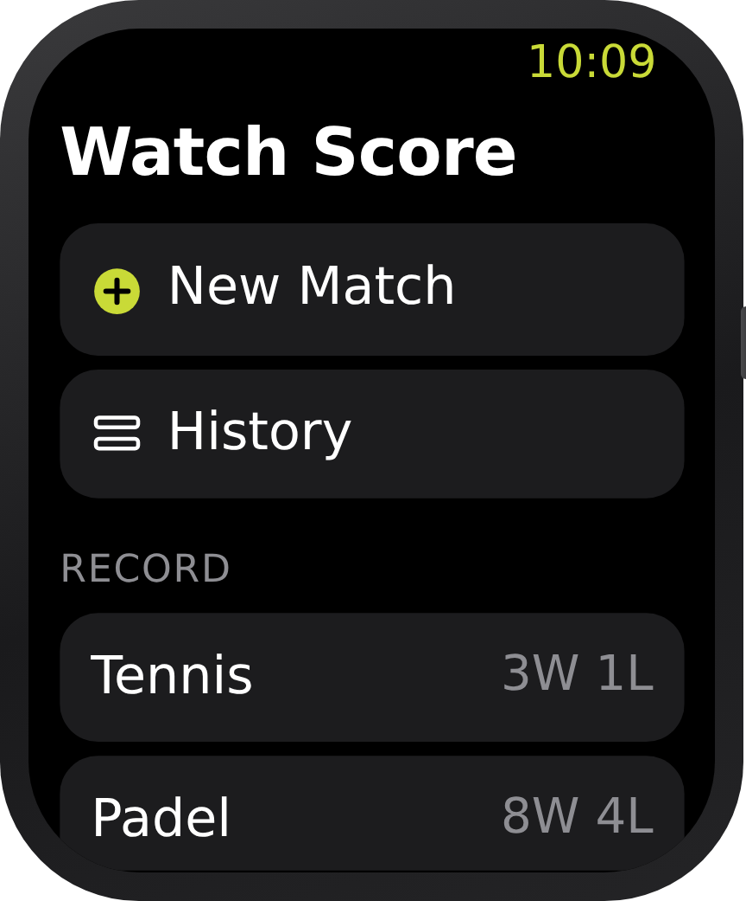
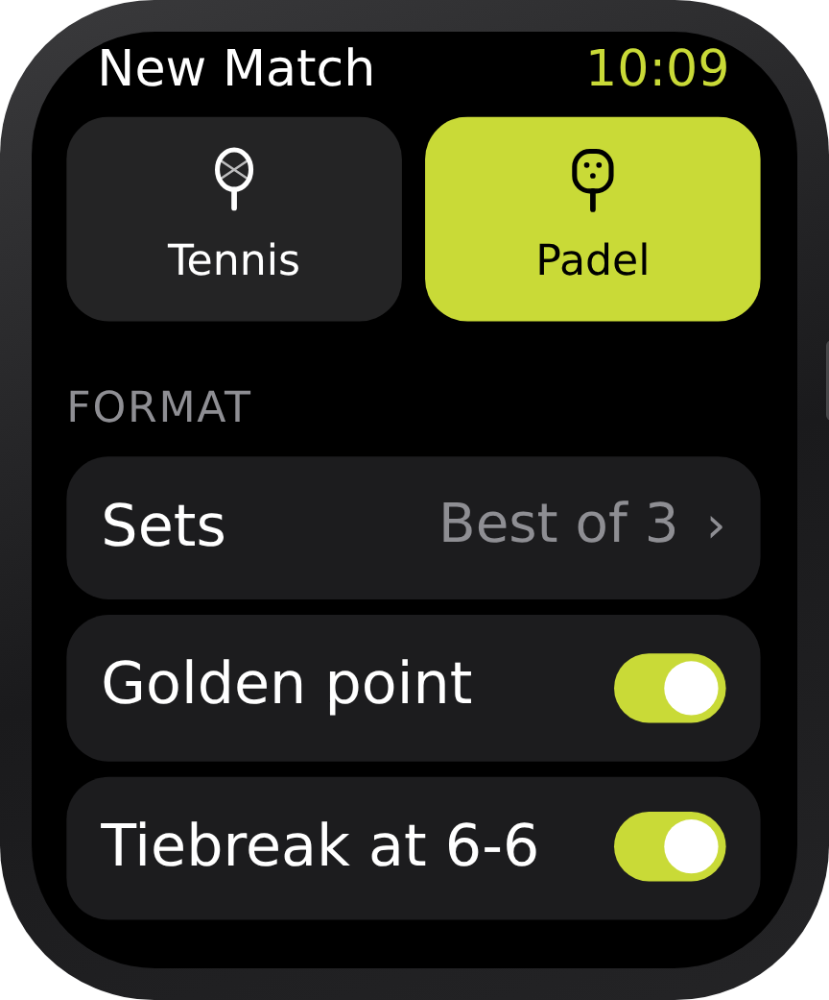
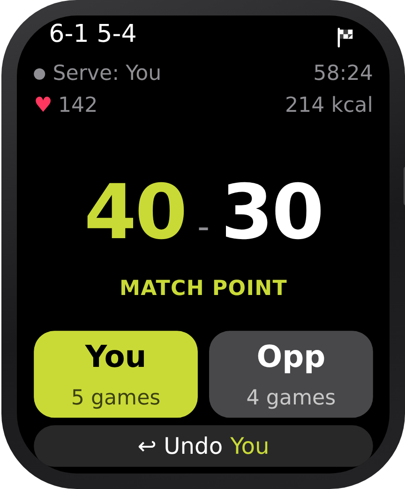
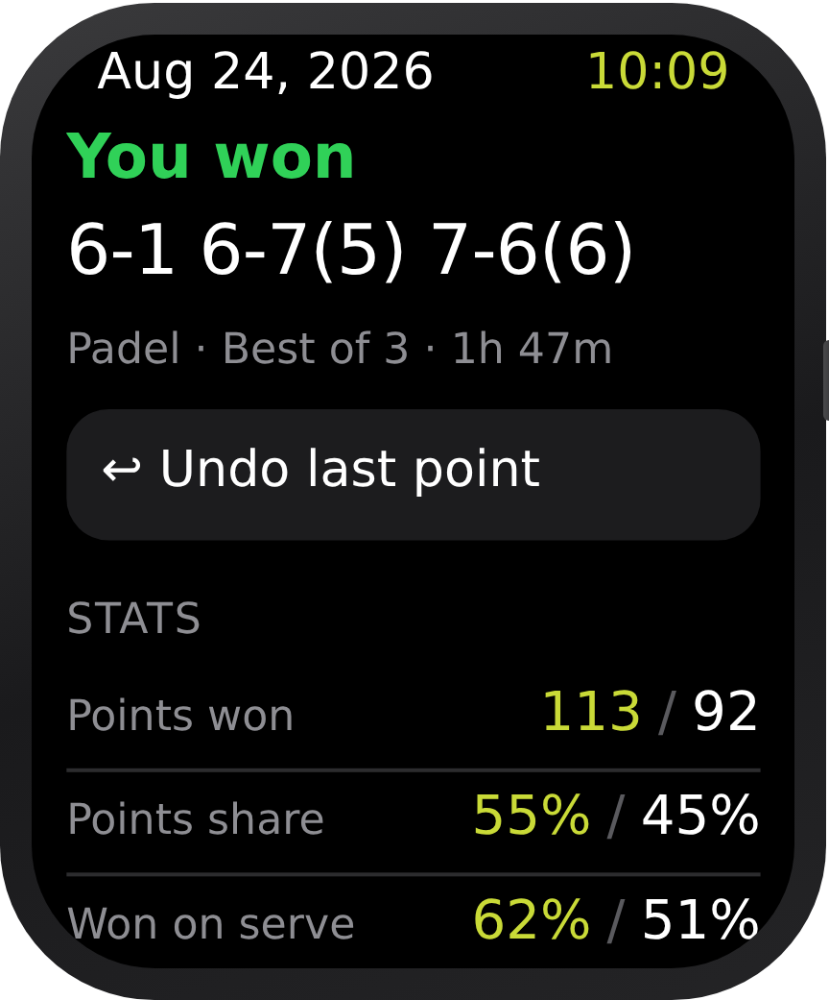
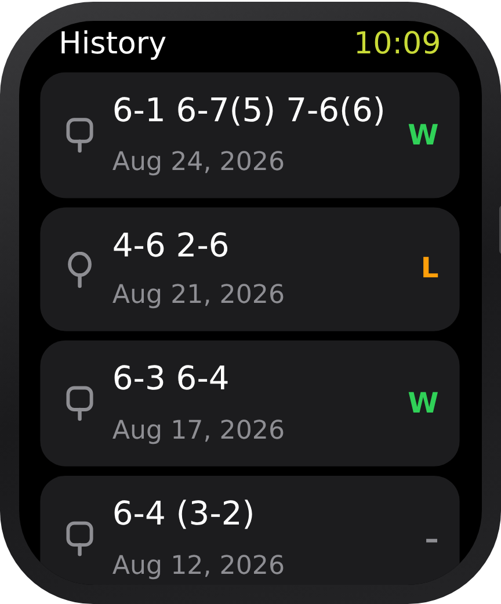

# Watch Score

An Apple Watch app for scoring tennis and padel matches, and keeping the stats
afterwards. Standalone watchOS app — no iPhone companion needed.

## What it does

- **Score a match with two taps per point.** One big button per side, a haptic on
  every point, a stronger one on every game, set and match.
- **Knows the rules.** 15/30/40, deuce and advantage, golden point (*punto de
  oro*) for padel, tiebreak at 6-6 with the right serving rotation, 1 set or best
  of 3.
- **Tells you what is at stake.** The score screen calls out game point, set
  point, match point and golden point as they come up.
- **Undo any point**, however far back. The button under the score names the
  side it will correct ("Undo Opp"), and taking a point back rewinds games,
  sets, serve and stats with it. If the mistaken point ended the match, the
  summary offers the same way back onto the court.
- **Stats when the match ends:** points won, points share, points won on serve,
  games, breaks of serve and longest run of points, for both sides.
- **History** of every match, with your win/loss record per sport.
- **Stays awake while you play.** Each match runs as a HealthKit workout, so
  dropping your wrist between points does not send the app to sleep. Heart rate
  and calories show next to the score, get saved with the result, and the match
  lands in Health as a workout that counts towards your rings.

Matches are stored on the watch as a JSON file, so there is nothing to set up
and nothing leaves the device.

## The screens

> **Mockups, not simulator screenshots.** They are drawn from the SwiftUI layout
> code at the true size of a 45 mm display, 198 × 242 points, with the scores and
> stats the app would really put there. The icons stand in for SF Symbols, and
> the match shown is a real one played through the scoring engine: 6-1, 6-7(5),
> 7-6(6) over 205 points.

| Home | New match | Scoring |
| :---: | :---: | :---: |
|  |  |  |
| Two ways in, and your record per sport. | Opens on whatever format you played last. | Serve, clock, heart rate, what is at stake, and an undo that names the side it will correct. |

| Summary | History |
| :---: | :---: |
|  |  |
| Saved as soon as the match ends, with a way back onto the court if it ended by mistake. Scrolls on to heart rate, calories and the set-by-set breakdown. | Newest first. The last row is a match ended early: the unfinished set in brackets, and neither a win nor a loss. |

## Running it

1. Open `WatchScore.xcodeproj` in Xcode 15 or newer.
2. Select the **WatchScore** scheme and an Apple Watch simulator, then Run.
3. To run it on your own watch, pick your team under *Signing & Capabilities*
   and change the bundle identifier from `com.example.WatchScore` to something
   of your own.

Requires watchOS 10 or newer.

The first match asks for permission to read heart rate and calories and to save
workouts. Decline it and everything still works — you just get no vitals, and
the app can sleep when your wrist drops.

**Heart rate needs a real watch.** The simulator has no sensor, so on the
simulator the match still scores and saves, but the vitals are simply absent
from the summary.

## How it is put together

| File | What lives there |
| --- | --- |
| `Models/MatchEngine.swift` | All the scoring rules, as one value type. `score(_:)` is the only way a match moves forward. |
| `Models/MatchStats.swift` | Counters kept as the match is played, so the summary needs no replay. |
| `Models/MatchController.swift` | Undo stack and haptics for the match on screen. |
| `Models/MatchRecord.swift` | A finished match, as it is stored. |
| `Health/WorkoutTracker.swift` | The HealthKit workout that keeps the app awake and collects heart rate and calories. Scoring never depends on it. |
| `Storage/MatchStore.swift` | The match history file, and the last format used. |
| `Views/` | The five screens: home, new match, scoring, summary, history. |

The engine is a plain `struct` with no UI or storage in it, which is what makes
undo a matter of keeping the previous value around.

The app icon is drawn by `Tools/make_icon.py` — change a colour at the top of
that file and run it to regenerate.

## Ideas for later

- Serve/return splits per set, and stats across matches (win rate by opponent,
  by sport, by month).
- A complication to start a match straight from the watch face.
- Doubles: name the four players and track who served.
